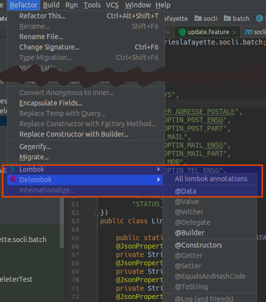
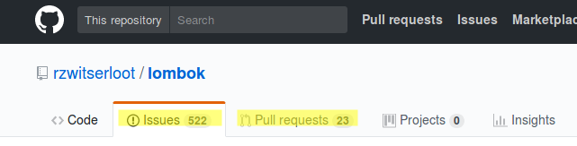

title: Lombok
author:
    name: "Thomas Queste"
    url: "tomsquest.com"
    email: "tom@tomsquest.com"
    twitter: "@ThomasQueste"
output: index.html
style: index.css 
controls: false
--
# Lombok


--
### Goals

1. Reduce boilerplate
1. Reduce maintenance
--
### @Builder

Given:

```java
@Builder
public class Line {
    private String adresseLigne1;
    private String codePostal;
    private String ville;
    private CountryCode country;
}
```

Usage:

```java
Line line = Line.builder()
            .adresseLigne1("adresseLigne1")
            .codePostal("codePostal")
            .ville("ville")
            .countryCode(CountryCode.DE)
            .build();
```
--
### @Value = Immutable

Given:

```java
@Value
public class Point {
    private int x;
    private int y;
}
```

Usage:

```java
Point p = new Point(x,y);
p.getX()
p.getY()
p.toString()

new Point(1.2).equals( new Point(3,4) ) // + hashcode
```
--
### @Data = Java Bean

Given:

```java
@Data
public class Point {
    private int x;
    private int y;
}
```

Usage:

```java
Point p = new Point();
p.setX(1)
p.setY(2)
p.toString()
new Point(1.2).equals( new Point(3,4) ) // + hashcode
```
--
### Delombok



--
### Some **stable** features

* `@Log`: declare a logger  
* `val`: final local variable + type inferred  
* `@NonNull`: checks for nulls  
* `@Getter/@Setter`  
* `@ToString`  
* `@EqualsAndHashCode`  
* `@NoArgsConstructor`, `@RequiredArgsConstructor`, `@AllArgsConstructor`  
--
# Some Experimental features
--
### @Accessors

Fluent API for getters and setters, return `this` instead of `void` in setters

```java
public Line country(CountryCode country) {
    this.country = country;
    return this;
}

line
  .country(FR)
  .name("FOO")
```

--
### @Wither
Immutable 'setters' - methods that create a clone but with one changed field

```java
public Line withCountry(CountryCode country) {
    return this.country == country ? this : new Line(idSocle, prenom, nom, country);
}

Line line2 = line1.withCountry(FR)
```
--
### Caveats

* IDE Plugin needed
* Source annotation enabled
* Java 9 unsupported as of 2017.10
* Many opened issues & PR 

